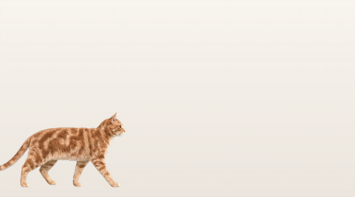
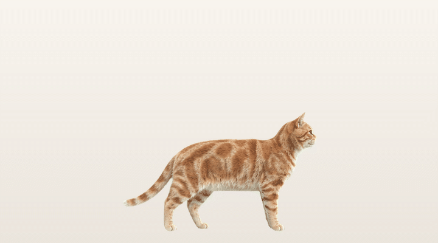
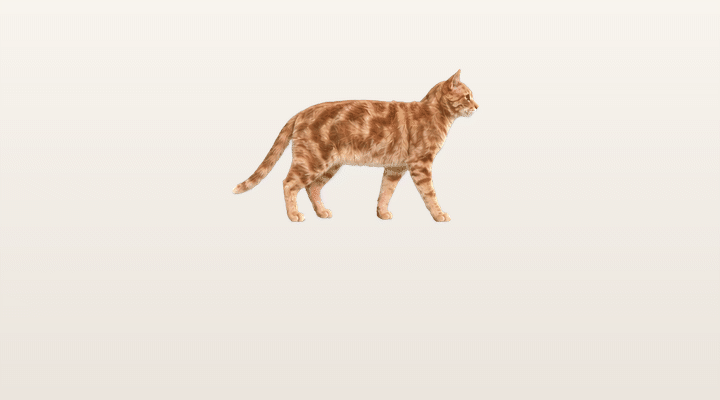
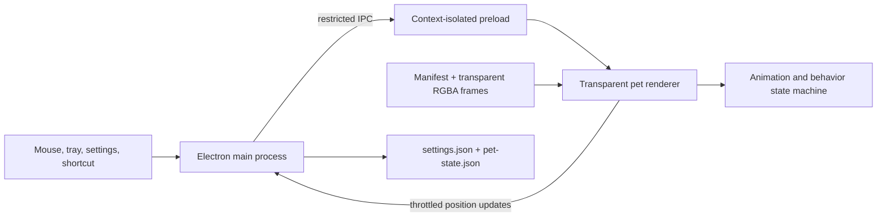

# Bambi 2D Desktop Pet

Bambi is a Windows desktop pet rendered from transparent 2D animation frames.
The active application uses Electron rather than Unity or Blender, so the cat is
a lightweight animated desktop overlay instead of a real-time 3D model.

> **Status: Beta.** Core behavior is implemented and automatically tested, but
> the application has not completed broad multi-monitor, long-running,
> installer, code-signing, or end-user acceptance testing.

## Why Bambi?

Bambi is the name of my cat. I started this project because I wanted to be able
to see Bambi on my desktop while I work, even when my real cat is somewhere else
resting or exploring. What began as a small personal companion gradually became
an experiment in transparent windows, animation, interaction, and preserving a
cat's recognizable appearance in a desktop character.

The project is still growing, and I may add more behaviors, interactions, and
personalization features over time. The main goal will stay the same: make the
desktop feel a little warmer without getting in the way of work.

This repository contains the desktop software and its sprite-processing tools
only. Website and cloud-service prototypes are intentionally excluded.

## Animation previews

### Walking across the desktop



### Grooming



### Pickup and landing



## Current features

- Transparent, borderless, always-on-top Windows 10/11 overlay.
- Pixel-level hit testing: the cat receives input while transparent areas pass
  clicks through to other applications.
- Eight-frame animations for walking, idle breathing, lying down, sleeping,
  eating, petting, pickup, landing, grooming, and three rest poses.
- Automatic walking, screen-edge wrapping, random actions, procedural breathing,
  and configurable random-action cooldowns.
- Double-click the head to pet the cat.
- Drag after a small movement threshold to pick it up and place it elsewhere.
- Right-click to open random-action switches, fixed rest, settings, and exit.
- System tray controls for settings, pause, size, recovery, and exit.
- Launch-at-login, movement speed, scale, and cooldown settings.
- Position, selected display, pause, and fixed-rest state persist across restarts.
- `Ctrl+Shift+H` or the tray command **Find Cat** moves the pet to a safe position
  on the display containing the mouse pointer.
- Replaceable sprite packs described by a manifest rather than hard-coded assets.

## Architecture



### Electron main process

[`desktop-2d/main.mjs`](desktop-2d/main.mjs) owns operating-system integration:

- creates the transparent pet window and settings window;
- keeps the pet above normal windows while hiding it from the taskbar;
- manages the tray menu and `Ctrl+Shift+H` global shortcut;
- selects and restores the saved display;
- receives validated state updates and writes them to Electron `userData`;
- exposes narrow IPC handlers instead of renderer-side Node access.

### Security bridge

[`desktop-2d/preload.cjs`](desktop-2d/preload.cjs) is the only bridge between
renderer code and Electron APIs. Context isolation is enabled, renderer Node
integration is disabled, and only settings, state, pointer-probe, menu, and
command operations are exposed.

### Renderer and input handling

[`desktop-2d/renderer/pet.js`](desktop-2d/renderer/pet.js) is responsible for:

- preloading every animation frame before playback;
- keeping the previous decoded frame visible until the next frame is ready;
- swapping two image layers without transparent blank flashes;
- applying horizontal mirroring for left-facing movement;
- alpha-mask hit testing against the currently displayed frame;
- distinguishing a click from a drag using a movement threshold;
- anchoring pickup and head-petting animations to the pointer;
- rendering movement, drop recovery, and procedural breathing.

### Behavior state machine

[`desktop-2d/src/state-machine.mjs`](desktop-2d/src/state-machine.mjs) contains
testable behavior without Electron dependencies:

- action transitions and frame selection;
- random action eligibility and cooldown timing;
- walking speed, direction changes, and screen-edge wrapping;
- safe drop and recovery positions;
- head-region detection;
- pickup, landing, rest, sleep, and grooming sequence timing.

### Settings and runtime state

- [`settings-store.mjs`](desktop-2d/src/settings-store.mjs) validates scale,
  movement speed, launch-at-login, action switches, and cooldown values.
- [`pet-state.mjs`](desktop-2d/src/pet-state.mjs) validates position, display,
  pause, and fixed-rest state.
- Position reports and disk writes are throttled instead of running every frame.
- A missing saved monitor falls back to the primary display and the restored
  position is clamped to a visible area.

### Sprite-pack system

The active pack is located at
[`desktop-2d/sprite-packs/orange-tabby/`](desktop-2d/sprite-packs/orange-tabby/).
It contains:

- `manifest.json`: action names, frame paths, timing, loop behavior, canvas, and
  drag anchors;
- `frames/`: normalized `520x520` transparent RGBA runtime frames;
- `source/`: source sprite sheets retained for deterministic rebuilding.

The pack currently declares 18 actions. Longer behaviors combine entry, loop or
procedural hold, and exit stages. Validation checks frame count, dimensions,
alpha, manifest references, and grooming color consistency.

## Runtime flow

1. Electron selects the saved display or falls back to the primary display.
2. The main process loads validated settings and runtime state.
3. The preload bridge supplies bootstrap data and the active sprite manifest.
4. The renderer decodes all frames before animation begins.
5. The state machine selects walking and enabled random actions.
6. Pointer probes and the current frame's alpha mask decide whether the overlay
   receives input or passes it through.
7. Position changes are throttled before being persisted.

## Repository layout

```text
bambi-2d-desktop-pet/
├─ desktop-2d/
│  ├─ renderer/            Pet overlay and settings UI
│  ├─ sprite-packs/        Source sheets, runtime frames, manifests
│  ├─ src/                 State machine and persistence modules
│  ├─ tests/               Node unit tests
│  ├─ tools/               Windows packaging helpers
│  ├─ main.mjs             Electron main process
│  └─ preload.cjs          Restricted IPC bridge
├─ tools/                  Sprite import, retone, and validation utilities
├─ README.md
└─ .gitignore
```

Generated executables, dependencies, temporary image-generation files, and the
separate website prototype are not tracked by this repository.

## Development

Requirements:

- Windows 10 or 11
- Node.js and npm
- Python 3 with the packages listed in `tools/requirements-sprite.txt` for sprite
  processing and validation

```powershell
cd desktop-2d
npm install
npm test
npm start
```

Build the ordinary unpacked Windows application:

```powershell
npm run pack:dir
```

Output:
`desktop-2d/dist/win-unpacked/YourCatDesktopPet.exe`

Build artifacts and dependencies are intentionally ignored. A Portable build
script remains in the source tree for development history, but Portable releases
are not part of the current workflow.

## Interaction reference

| Input | Result |
| --- | --- |
| Double-click the cat's head | Play the petting reaction |
| Left-drag the cat | Pick up and reposition it |
| Right-click the cat | Lie down and open the action-control menu |
| `Ctrl+Shift+H` | Recover the cat on the mouse pointer's display |
| Tray: Pause / Continue | Persistently pause or resume behavior |
| Tray: Find Cat | Recover the cat without using the shortcut |

## Validation

```powershell
cd desktop-2d
npm test
```

The test command validates the sprite pack and grooming palette, then runs the
settings, persistence, movement, hit-region, animation, pickup, landing, rest,
and recovery unit tests.

Rebuild the README animation previews from the current sprite pack with:

```powershell
python ..\tools\build_readme_gifs.py
```

Automated checks do not replace real Windows interaction testing. Transparent
click-through behavior, global shortcut conflicts, multiple physical displays,
DPI combinations, visual transition quality, and long-running stability still
require hands-on acceptance testing.

## Beta limitations

- Windows-only; macOS and Linux behavior has not been implemented or validated.
- One bundled orange-tabby pack; users cannot yet create or install their own
  personalized cat in the UI.
- No signed installer, automatic updater, crash reporting, or release channel.
- Multi-monitor restoration and recovery have automated coverage but need wider
  real-device testing.
- No sound, camera reaction, mouse chasing, or window-edge jumping.
- No production personalization, account, payment, or cloud-generation service.

## Roadmap

The phases below are proposals rather than delivery promises. Each phase has an
exit gate so scope only expands after the current layer is reliable.

### Phase 0 — Beta stabilization

- Run long-duration tests across common Windows 10/11 and DPI configurations.
- Complete multi-monitor, sleep/wake, taskbar-layout, and shortcut-conflict tests.
- Add repeatable visual regression captures for every animation transition.
- Improve accessibility and add shortcut remapping.
- Audit the release licensing of all source and generated visual assets.

**Exit gate:** the pet runs for a full day without disappearing, blocking other
windows, losing settings, or showing blank animation frames.

### Phase 1 — Installable sprite packs

- Define a versioned public manifest schema and compatibility validator.
- Add local import, preview, rollback, and pack selection in settings.
- Package multiple verified cats without changing application code.
- Normalize scale, baseline, anchors, palette, and transparent hair edges.

**Exit gate:** a verified sprite pack can be installed and selected without
rebuilding the Electron client.

### Phase 2 — Personalized cat pipeline

- Accept guided front, side, and back photos with quality and privacy checks.
- Produce an identity preview before generating the complete animation pack.
- Preserve face shape, eye color, body proportions, tail, and coat markings
  consistently across every action.
- Validate generated packs automatically and provide recoverable retries.
- Import completed packs through the Phase 1 package interface.

**Exit gate:** owners consistently recognize their own cat across the full
action set, and failed generations recover without manual file repair.

### Phase 3 — Rich desktop behavior

- Optional mouse chasing, window-edge navigation, and richer feeding behavior.
- Optional sound or camera reactions with explicit permissions and local-first
  processing where practical.
- Personality profiles, schedules, and behavior-intensity controls.
- Multiple pets with predictable performance and interaction priority.

**Exit gate:** additional behavior remains controllable, privacy-preserving, and
does not interfere with normal desktop work.

### Phase 4 — Windows release

- Signed installer, automatic-update strategy, release channels, and rollback.
- First-run onboarding, localization, diagnostics export, and opt-in telemetry.
- Performance budgets for memory, CPU, GPU, startup time, and package size.
- Public issue templates, contribution rules, and asset licensing.

**Exit gate:** a signed release can be installed, updated, diagnosed, and removed
cleanly by a non-technical Windows user.

## Additional ideas

- A local animation-pack workshop with anchor and alpha-bound previews.
- Seasonal accessories as independent overlays so the base cat is unchanged.
- Import/export behavior settings independently from private cat assets.
- A battery-saver mode that lowers frame rate while unplugged.
- Per-action frequency controls in addition to the global cooldown.
- A privacy dashboard for personalized packs and their source photos.
- A community pack format after licensing, moderation, and compatibility rules
  are defined.

## License and contributions

This project is open source under the [MIT License](LICENSE). You may use,
modify, and distribute it subject to the license terms. Contributions are
welcome; contribution guidelines and issue templates may be added as the Beta
matures.
