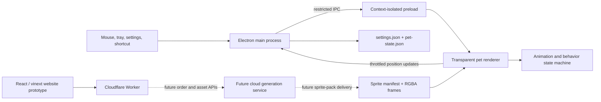

# Bambi 2D Desktop Pet

Bambi is a Windows desktop-pet project built around transparent 2D animation
packs. The active client uses Electron rather than Unity or Blender, so the cat
is rendered as a lightweight animated overlay instead of a real-time 3D model.

> **Status: Beta.** The desktop client is functional and automatically tested,
> but it has not completed broad multi-monitor, long-running, installer,
> code-signing, or end-user acceptance testing. The website is currently a
> product prototype; photo upload, cloud generation, accounts, payment, and
> order delivery are not connected yet.

## What works today

- Transparent, borderless, always-on-top Windows 10/11 desktop window.
- Pixel-level hit testing: the cat receives input while transparent areas pass
  clicks through to the desktop and other applications.
- Eight-frame animations for walking, idle breathing, lying down, sleeping,
  eating, petting, pickup, landing, grooming, and three rest poses.
- Automatic walking, screen-edge wrapping, random actions, procedural breathing,
  and configurable random-action cooldowns.
- Double-click the head to pet; drag after a small movement threshold to pick up
  and reposition the cat; right-click to open the action-control menu.
- Fixed-rest and pause modes, system tray controls, launch-at-login, size and
  speed settings, and persisted position/display/state across restarts.
- `Ctrl+Shift+H` or the tray command **Find Cat** moves the pet to a safe position
  on the display containing the mouse pointer.
- Replaceable sprite packs described by a manifest instead of hard-coded assets.

## System architecture



### Windows desktop client

The maintained client lives in [`desktop-2d/`](desktop-2d/).

| Layer | Main files | Responsibility |
| --- | --- | --- |
| Electron main process | `desktop-2d/main.mjs` | Creates the transparent overlay and settings windows, owns tray/global shortcuts, selects displays, persists runtime state, and exposes narrow IPC handlers. |
| Security bridge | `desktop-2d/preload.cjs` | Exposes only the settings, state, pointer-probe, and command APIs needed by the renderers. Renderer Node access is disabled and context isolation is enabled. |
| Pet renderer | `desktop-2d/renderer/pet.js` | Preloads animation frames, swaps decoded image layers without blank frames, performs alpha-mask hit testing, handles dragging and head petting, and renders movement. |
| Behavior model | `desktop-2d/src/state-machine.mjs` | Contains deterministic frame selection, action transitions, cooldown selection, movement, edge wrapping, safe drop positions, and recovery positioning. |
| Persistence | `desktop-2d/src/settings-store.mjs`, `desktop-2d/src/pet-state.mjs` | Validates and stores user settings plus position, display, pause, and fixed-rest state under Electron `userData`. Writes are throttled rather than performed every frame. |
| Sprite assets | `desktop-2d/sprite-packs/orange-tabby/` | Holds the active manifest, source sheets, and normalized transparent `520x520` RGBA frames. Left-facing movement is produced by horizontal mirroring. |

The active orange-tabby pack currently declares 18 actions. Most actions use
eight frames; longer behaviors combine an entry animation, a loop or procedural
hold, and an exit animation. Validation checks frame count, dimensions, alpha,
manifest references, and grooming color consistency.

### Website and future cloud layer

The repository root contains a React 19 website built with vinext and Vite:

- `app/`: landing page and static cat-builder prototype.
- `worker/`: Cloudflare Worker entry point and image-optimization routing.
- `db/`: Drizzle integration point; the production schema is intentionally
  empty until real product data is required.
- `.openai/hosting.json`: current site-hosting project configuration.

The website and desktop client are not yet connected. The current page describes
the longer-term personalized-pet concept, but there is no production upload,
generation, payment, or download API in this Beta.

## Runtime data flow

1. Electron starts on the saved display, falling back to the primary display if
   that monitor no longer exists.
2. The main process loads validated settings and pet state, then sends the sprite
   manifest and bootstrap data through the preload bridge.
3. The renderer preloads every frame before animation begins and keeps the old
   image visible until the next decoded frame is ready.
4. The animation state machine selects movement and enabled random actions.
5. Pointer probes and the current frame's alpha mask determine whether the window
   should receive input or pass it through.
6. Position changes are throttled before being written to `pet-state.json`.

## Repository layout

```text
DesktopPet/
├─ desktop-2d/             Electron Windows client
│  ├─ renderer/            Pet and settings UI
│  ├─ sprite-packs/        Source sheets, normalized frames, manifests
│  ├─ src/                 State machine and persistence modules
│  ├─ tests/               Node unit tests
│  └─ tools/               Windows packaging helpers
├─ app/                    Website UI prototype
├─ worker/                 Cloudflare Worker entry point
├─ db/                     Future Drizzle schema and database adapter
├─ tests/                  Website build/render tests
├─ tools/                  Sprite import, retone, and validation tools
└─ output/imagegen/        Preserved source-generation outputs
```

## Development

### Desktop client

Requirements:

- Windows 10 or 11
- Node.js and npm
- Python 3 with the packages listed in `tools/requirements-sprite.txt` for sprite
  processing and validation

```powershell
cd desktop-2d
npm install
npm test
npm start
```

Build the ordinary unpacked Windows application:

```powershell
npm run pack:dir
```

Output:
`desktop-2d/dist/win-unpacked/YourCatDesktopPet.exe`

Build artifacts and dependencies are not committed. A Portable build script is
retained for development history, but Portable releases are not part of the
current workflow.

### Website

The website requires Node.js `>=22.13.0`.

```powershell
npm install
npm test
npm run dev
```

`npm test` performs a production build and validates rendered HTML. `npm run
build` creates the production site bundle.

## Beta limitations

- Windows-only; macOS and Linux behavior has not been implemented or validated.
- The app currently ships one orange-tabby sprite pack rather than a user-created
  personalized cat.
- No signed installer, auto-updater, crash reporting, or release channel.
- Multi-monitor restoration and the global recovery shortcut have automated
  coverage but still need wider real-device testing.
- No sound, camera reaction, mouse chasing, or window-edge jumping.
- The website is not connected to the desktop client or a production backend.
- There is no account, payment, order, revision, or cloud-generation system.

## Roadmap

The phases below are proposals, not delivery promises. Each phase should be
validated before the next one expands the product surface.

### Phase 0 — Beta stabilization

- Run long-duration tests across common Windows 10/11 and DPI configurations.
- Complete multi-monitor, sleep/wake, taskbar-layout, and shortcut-conflict tests.
- Add repeatable visual regression captures for every animation transition.
- Improve accessibility and expose shortcut remapping.
- Decide which current source/generated assets are release-licensed.

**Exit gate:** the desktop pet can run for a full day without disappearing,
blocking unrelated windows, losing settings, or showing blank animation frames.

### Phase 1 — Sprite-pack productization

- Define a versioned public sprite-pack schema and compatibility validator.
- Add local import, preview, rollback, and pack selection in settings.
- Package multiple verified cats without changing application code.
- Add deterministic normalization for scale, baseline, anchors, palette, and
  transparent hair edges.

**Exit gate:** a new verified sprite pack can be installed and selected without
rebuilding the Electron client.

### Phase 2 — Personalized cat generation

- Accept guided front, side, and back photos with quality/privacy checks.
- Generate a low-cost identity preview before producing the full animation pack.
- Preserve face shape, eye color, body proportions, tail, and coat markings
  consistently across all actions.
- Add an asynchronous job API, progress reporting, retries, and pack validation.
- Deliver the finished pack securely to the desktop client.

**Exit gate:** owners consistently recognize their own cat across the complete
action set, and failed generations can recover without manual file repair.

### Phase 3 — Accounts, orders, and revisions

- Add authentication, order history, storage retention controls, and deletion.
- Integrate payment only after static preview approval.
- Support bounded free retries and two localized post-payment corrections.
- Treat new photos or a different cat as a new order.
- Record generation cost, failure rate, and revision causes without storing more
  personal data than necessary.

**Exit gate:** the purchase-to-delivery flow is auditable, recoverable, and has a
clear refund/retry policy.

### Phase 4 — Rich desktop behavior

- Optional mouse chasing, window-edge navigation, and richer feeding interactions.
- Optional microphone/camera reactions with explicit permissions and local-first
  processing where practical.
- Personality profiles, schedules, and behavior intensity controls.
- Multiple pets with predictable performance and interaction priority.

**Exit gate:** new behaviors remain controllable, privacy-preserving, and do not
interfere with normal desktop work.

### Phase 5 — Release and distribution

- Signed installer, auto-update strategy, release channels, and rollback.
- Localization, first-run onboarding, diagnostics export, and opt-in telemetry.
- Performance budgets for memory, CPU, GPU, startup time, and package size.
- Public documentation, issue templates, contribution rules, and asset licensing.

**Exit gate:** a signed release can be installed, updated, diagnosed, and removed
cleanly by a non-technical Windows user.

## Additional ideas

- A local animation-pack workshop with anchor and alpha-bound previews.
- Seasonal accessories as separate overlays so the base cat identity is unchanged.
- Export/import of behavior settings independently from the private cat assets.
- A battery-saver mode that lowers frame rate when the device is unplugged.
- A privacy dashboard showing exactly which files are local, uploaded, retained,
  or deleted.
- A community pack format only after licensing, moderation, and compatibility
  rules are defined.

## License and contributions

No open-source license has been selected yet. Until a license is added, the code
and visual assets remain all rights reserved. Contribution and redistribution
rules should be defined before accepting external submissions.
